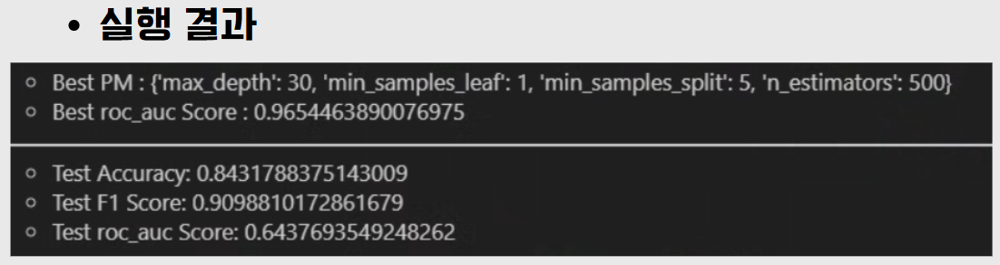
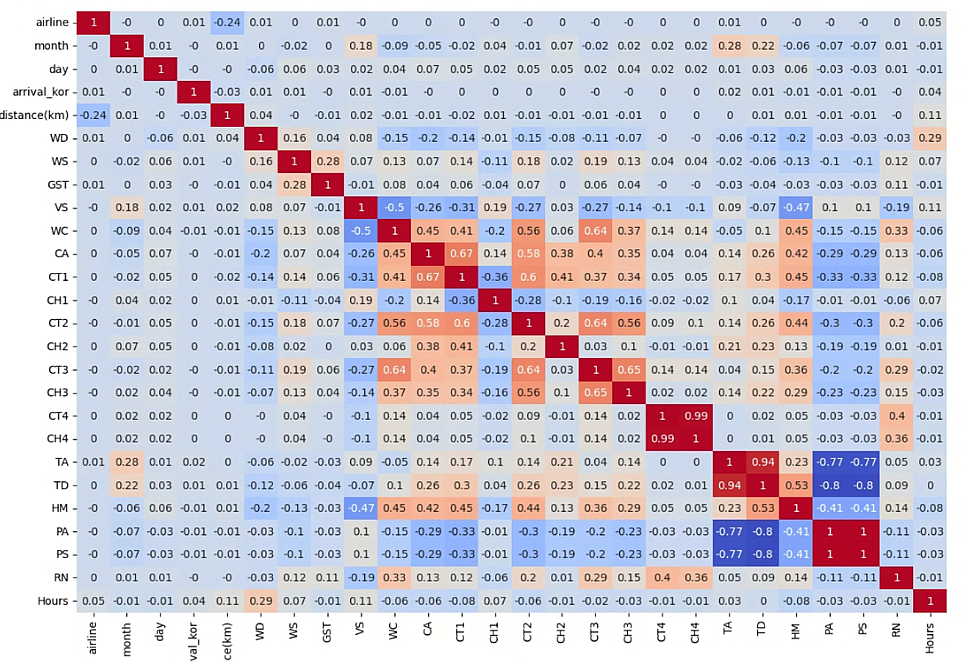
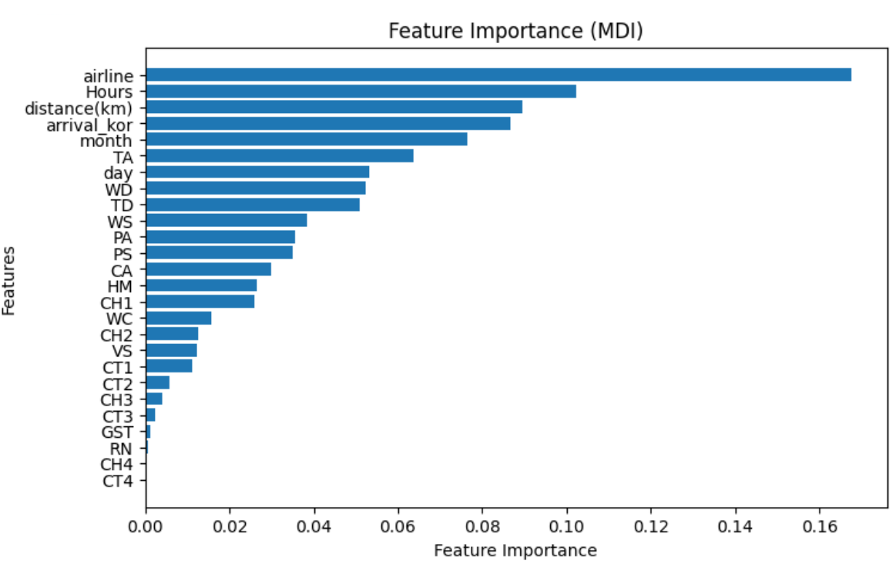
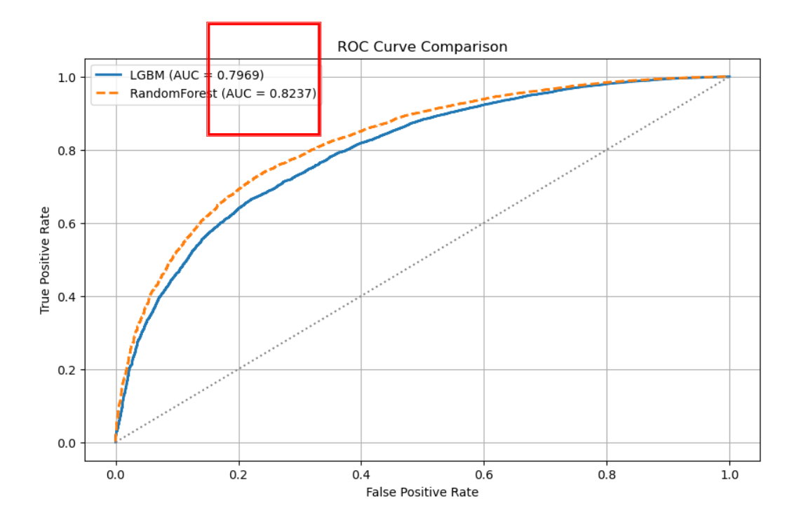
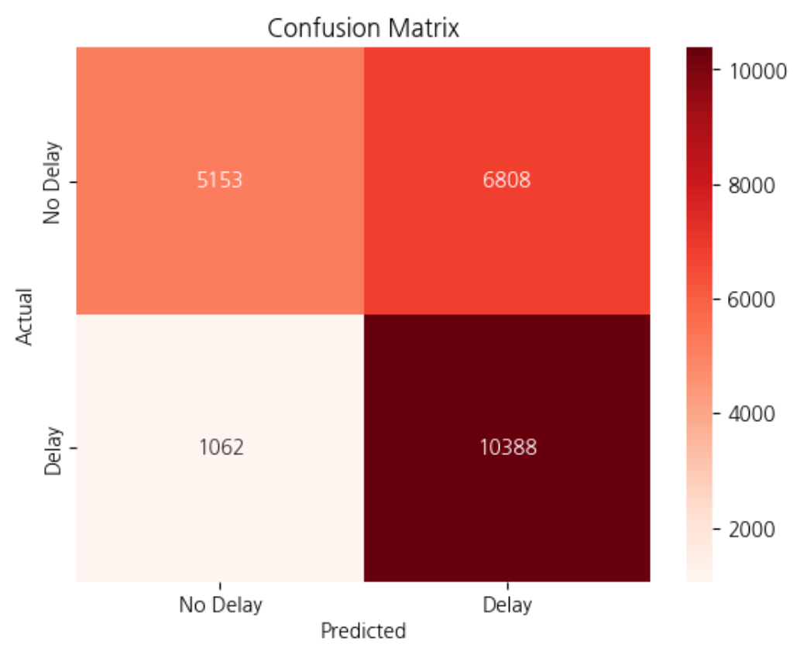

# Flight Delay Prediction Project ✈️

## 📁 프로젝트 구조
```
project-root/
├── data/
│   ├── airportal.csv
│   └── weather_data.csv
├── notebooks/
│   ├── 프로젝트_이장헌_250122.ipynb       # 1차 데이터 전처리 및 파생 변수 생성
│   └── Random_forest_copy_2.ipynb        # 모델링 및 성능 평가, 피처 엔지니어링
└── README.md
```

---

## ✅ 1. 프로젝트 개요

본 프로젝트는 항공편의 지연 여부를 예측하는 머신러닝 모델을 개발하고,  
이를 통해 **인슈어테크(InsurTech)** 분야에서 활용 가능한 **자동 보상 보험 모델**을 제시하는 데 목적이 있습니다.

---

## 🧹 2. 데이터 처리 및 파생 변수 생성

노트북: `notebooks/프로젝트_이장헌_250122.ipynb`

- `airportal.csv`와 `weather_data.csv`를 기반으로 데이터를 정제하고 결합
- 출도착 시각의 차이로 지연 시간 및 지연 여부 생성
- `LabelEncoder`를 활용한 범주형 변수 처리
- 도착지 분해, 날짜·시간 단위 파생 변수 생성

이전 단계에서 준비된 전처리 데이터를 기반으로, 다음 단계에서 모델링을 수행합니다.

---

## 📊 3. 모델 학습 및 1차 결과

노트북: `notebooks/Random_forest_copy_2.ipynb`



- `RandomForestClassifier`를 기반으로 모델을 학습하고 최적 하이퍼파라미터를 탐색
- 학습 데이터에서 높은 ROC-AUC(0.96) 성능 기록
- 그러나 테스트 ROC-AUC는 0.64 수준으로 과적합 문제 발생

---

## 🧩 4. 1차 결과 문제점 분석

### 🔁 문제 1: 중복된 Feature 간 영향


- 다수의 기상 관련 변수 간 상관계수가 높아 다중공선성 존재

### 🚫 문제 2: 영향력 낮은 Feature 포함


- `Feature Importance` 결과에서 일부 피처는 기여도가 거의 없음

이러한 문제로 인해, 모델 성능이 실제 데이터에 일반화되지 못하고 있음이 드러났습니다.

---

## 📈 5. 피처 선택 및 2차 개선 결과



- 상관관계 및 중요도를 기준으로 주요 Feature만 재선택
- `LGBMClassifier`와 RandomForest를 비교하여 성능 개선 시도
- 최종적으로 AUC 0.82 수준으로 향상됨

---

## 🔁 6. 회고 및 모델 성능 한계



- Delay 클래스 데이터가 매우 많아 예측이 지연에 편향됨
- 클래스 불균형으로 인해 Confusion Matrix에서도 Delay 중심 예측 확인
- Recall은 높지만, 일반화 성능에는 주의가 필요함

---

## 💡 7. 인슈어테크 관점에서의 활용 가능성


- 항공권 예약 시, 자동 보상 보험 상품 추가 제안
- 머신러닝 예측을 기반으로 보험료를 책정하고, 지연 발생 시 자동 보상
- 고객 입장에서는 편리성 향상, 기업 입장에서는 부가 수익 창출 가능

---

## ⚙️ 사용 라이브러리
- `pandas`, `numpy`, `scikit-learn`, `lightgbm`
- `matplotlib`, `seaborn`, `koreanize-matplotlib`
- `cupy`, `scikit-learn-intelex`
